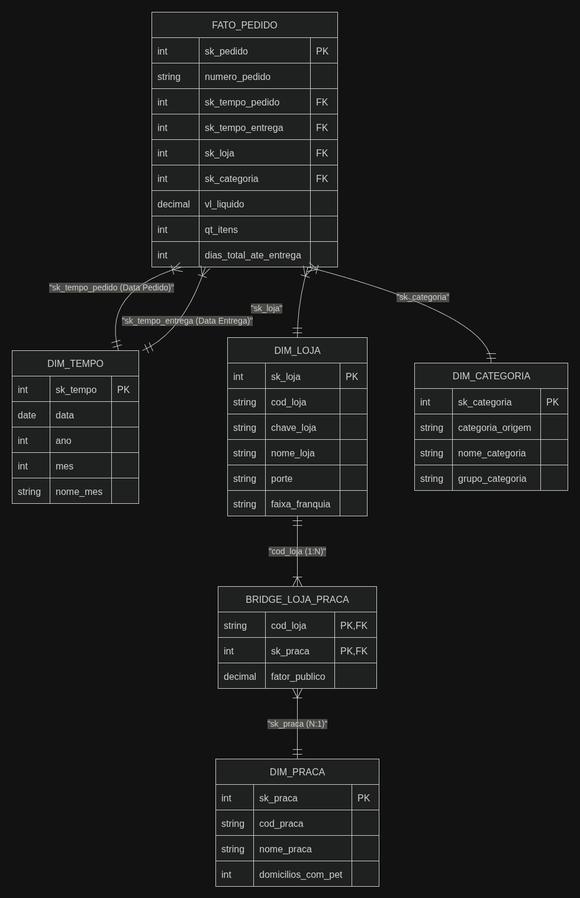
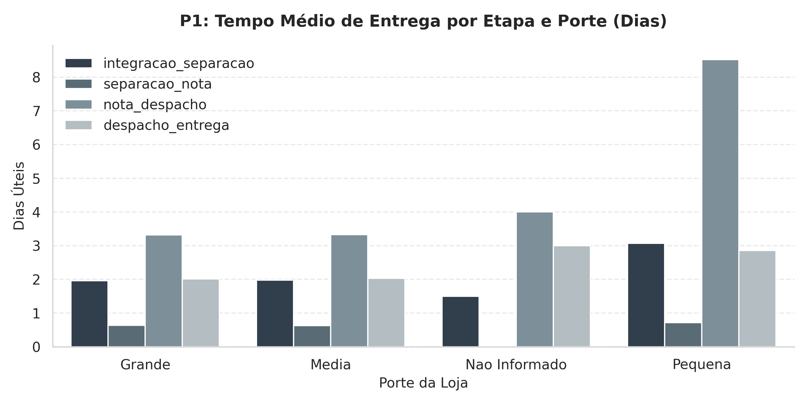
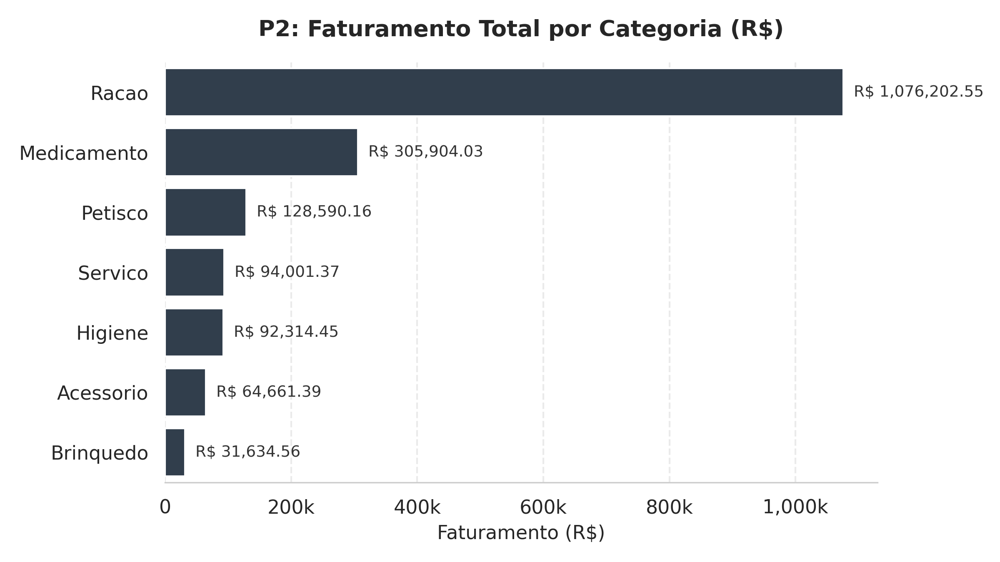
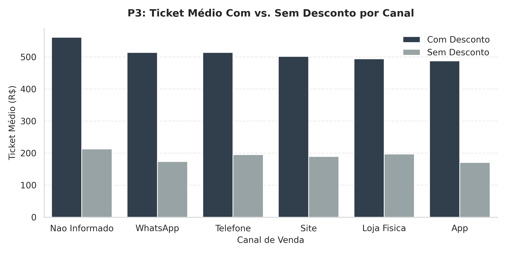
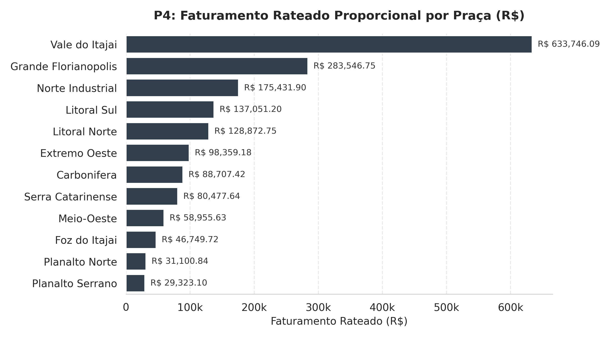
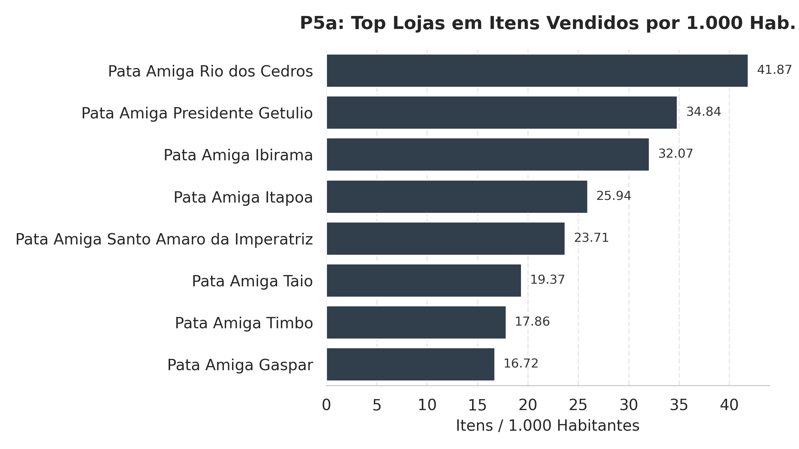
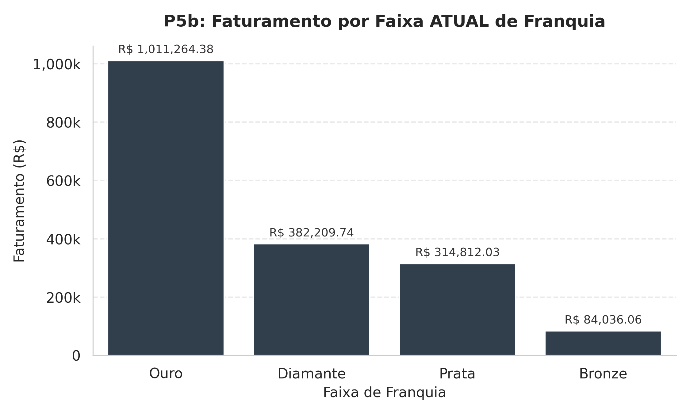
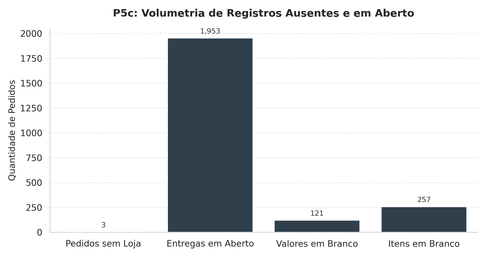

# DW Pata Amiga — Data Warehouse e Análise de Vendas

## 1. Visão Geral e Objetivo
A **Pata Amiga** é uma rede catarinense de pet shops com 32 lojas físicas distribuídas pelo estado. Em setembro de 2023, a empresa unificou a operação de pedidos omnichannel (App, Site, Loja Física, Telefone e WhatsApp), registrando 4.044 pedidos ao longo de 7 meses.

O objetivo deste projeto é integrar os dados legados de três sistemas distintos (plataforma de e-commerce, cadastro de franquias e planilha de praças de atendimento), construindo um **Data Warehouse em Star Schema (PostgreSQL 16)** para sanar problemas de inconsistência de dados, tratar duplicidades/grafias sujas e responder a cinco perguntas estratégicas de negócio para a diretoria.

---

## 2. Diagrama do Modelo Dimensional (Star Schema)

* **Grão da Tabela Fato:** 1 linha = 1 pedido (`fato_pedido` com 4.044 linhas).
* **Role-Playing Dimension (`dim_tempo`):** A dimensão de tempo se conecta duas vezes à tabela fato — uma para a **Data do Pedido** (`sk_tempo_pedido`) e outra para a **Data da Entrega** (`sk_tempo_entrega`).
* **Ligação N:N via Tabela Ponte (`bridge_loja_praca`):** Como uma loja atende múltiplas praças e uma praça é atendida por múltiplas lojas, a `dim_praca` se conecta à `dim_loja` através da ponte, utilizando o fator de rateio populacional (`fator_publico`).

---

## 3. Ordem de Execução dos Scripts

Para reproduzir o banco de dados do zero, execute os scripts SQL na seguinte ordem:

1. `01-carga-staging.sql`: Cria e popula as tabelas brutas de staging (`stg_pedido`, `stg_loja`, `stg_loja_praca`).
2. `02-dimensoes-prontas.sql`: Cria a estrutura de tabelas do Data Warehouse e popula a `dim_tempo` (236 linhas) e a `dim_loja` (33 linhas).
3. `03-dimensoes.sql`: Processa, trata e popula as dimensões customizadas (`dim_categoria`, `dim_praca`) e a tabela ponte (`bridge_loja_praca`).
4. `04-fato-pedido.sql`: Realiza a carga da `fato_pedido` (4.044 linhas) aplicando regras de limpeza, lookup por chaves naturais/nomes e cálculo de lags.
5. `05-perguntas.sql`: Contém as consultas analíticas para responder às perguntas de negócio P1 a P5 e realizar a conciliação numérico-financeira.

---

## 4. Diagnóstico da Origem (Staging)

A análise da área de staging revelou inconsistências críticas nos dados brutos:

* **Volumetria Inicial:** `stg_pedido` (4.044 linhas), `stg_loja` (32 linhas), `stg_loja_praca` (48 linhas).
* **Código de Loja Ausente:** 1.575 pedidos (~39% da base) vieram com a coluna `Cod Loja` vazia, exigindo o cruzamento por nome padronizado.
* **Pedidos Sem Loja Identificada:** Exatamente 3 pedidos vieram sem código e sem nome de loja na origem (redirecionados para a linha `-1 = Nao Informado`).
* **Marcos de Entrega em Branco:** 
  * Separação: 1.077 em branco
  * Nota Fiscal: 1.338 em branco
  * Despacho: 1.665 em branco
  * Entrega ao Cliente: 1.953 em branco (processos em aberto)
* **Poluição de Textos e Grafias:** 37 grafias distintas para apenas 7 categorias de produtos; dezenas de variações para nomes de lojas (acentos, maiúsculas, sufixos `/SC` e erros de digitação).

---

## 5. Decisões de Tratamento (ETL)

* **Máscaras de Data:** `DtHoraPedido` foi convertida com a máscara americana `TO_TIMESTAMP(..., 'MM/DD/YYYY HH12:MI AM')` e formatada para o inteiro `YYYYMMDD` da `dim_tempo`. Os marcos de entrega ISO foram convertidos com `::date`.
* **Regra dos Números e Nulos:** Valores como `""` e `"-"` em métricas numéricas ou datas foram gravados estritamente como `NULL` (nunca zero), preservando a precisão das médias de tempo (`AVG`). Símbolos `R$` e pontos de milhar foram removidos antes da conversão para `DECIMAL(15,2)`.
* **Precedência de Categorias:** No `CASE WHEN` da `dim_categoria`, o termo `MED` foi testado obrigatoriamente antes de `RA` para impedir que a *"Ração Medicamentosa"* fosse erroneamente classificada como *Racao* em vez de *Medicamento*.
* **Precedência de Canais:** No `CASE WHEN` da Fato, a busca por `WHATS` foi realizada antes de `APP` para evitar que os 414 pedidos de WhatsApp fossem assimilados pela regra do App.
* **Padronização de Loja:** Remoção de sufixos `/SC`, eliminação de espaços duplos e tratamento manual via `CASE` para três exceções da origem (`BLUMENAL` $\rightarrow$ `BLUMENAU`, `FLORIPA` $\rightarrow$ `FLORIANOPOLIS`, `JGUA` $\rightarrow$ `JARAGUA`).

---

## 6. Respostas às Perguntas de Negócio

### P1: Onde está o gargalo da entrega?

* **Maior Gargalo:** O intervalo entre a **Nota Fiscal e o Despacho** é a etapa mais lenta do processo logístico em todos os portes.
* **Impacto por Porte:**
  * **Lojas Pequenas:** Apresentam o maior tempo total médio de entrega (**15,16 dias**), onde o gargalo da Nota Fiscal ao Despacho consome **8,52 dias**.
  * **Lojas Médias:** Tempo total médio de **7,95 dias** (Nota ao Despacho: **3,33 dias**).
  * **Lojas Grandes:** Tempo total médio de **7,93 dias** (Nota ao Despacho: **3,32 dias**).
* **Conclusão P1:** O gargalo operacional não está no transporte/entrega final, mas sim no tempo de espera entre o faturamento e a liberação para a transportadora nas lojas de pequeno porte.

### P2: Qual categoria concentra o faturamento?

O faturamento total bruto da rede somou **R$ 1.793.308,51**.

* **Por Porte de Loja:** A categoria **Racao** é a campeã absoluta nos três portes de loja (Grande: R$ 468.186,60; Média: R$ 443.131,62; Pequena: R$ 164.197,55).

### P3: O desconto funciona igual em todo canal?

* **Volume e Faturamento por Canal:**
  * **App:** 1.273 pedidos | R$ 552.134,43 (**30,79%** do faturamento)
  * **Site:** 1.032 pedidos | R$ 450.569,37 (**25,13%**)
  * **Loja Fisica:** 824 pedidos | R$ 360.677,22 (**20,11%**)
  * **WhatsApp:** 414 pedidos | R$ 188.678,63 (**10,52%**)
  * **Telefone:** 264 pedidos | R$ 123.419,29 (**6,88%**)
  * **Nao Informado:** 237 pedidos | R$ 117.829,57 (**6,57%**)

  

* **Ticket Médio (COM vs SEM Desconto):**
  * **App:** COM R$ 488,04 vs SEM R$ 170,48
  * **Site:** COM R$ 501,92 vs SEM R$ 189,48
  * **Loja Fisica:** COM R$ 494,04 vs SEM R$ 196,78
  * **WhatsApp:** COM R$ 514,33 vs SEM R$ 173,88
  * **Telefone:** COM R$ 514,02 vs SEM R$ 195,46

* **Análise:** Em todos os canais, os pedidos com desconto apresentam um ticket médio significativamente maior (cerca de 2,5 a 3 vezes mais alto). Isso demonstra que as políticas de desconto estão atreladas a compras de pacotes/combos de alto valor agregado, funcionando com padrão similar em toda a rede.

### P4: Qual praça de atendimento concentra o faturamento?
Aplicando o rateio proporcional populacional via tabela ponte, a soma bateu **R$ 1.793.308,51** (diferença zero em relação ao total da rede):

1. **Vale do Itajai (Regional Leste):** R$ 633.746,09 | 148.000 domicílios com pet
2. **Grande Florianopolis (Regional Leste):** R$ 283.546,75 | 132.000 domicílios com pet
3. **Norte Industrial (Regional Norte):** R$ 175.431,90 | 96.000 domicílios com pet
4. **Litoral Sul (Regional Sul):** R$ 137.051,20 | 58.000 domicílios com pet
5. **Litoral Norte (Regional Norte):** R$ 128.872,75 | 61.000 domicílios com pet
6. **Extremo Oeste (Regional Oeste):** R$ 98.359,18 | 63.000 domicílios com pet
7. **Carbonifera (Regional Sul):** R$ 88.707,42 | 67.000 domicílios com pet
8. **Serra Catarinense (Regional Oeste):** R$ 80.477,64 | 44.000 domicílios com pet
9. **Meio-Oeste (Regional Oeste):** R$ 58.955,63 | 51.000 domicílios com pet
10. **Foz do Itajai (Regional Leste):** R$ 46.749,72 | 74.000 domicílios com pet
11. **Planalto Norte (Regional Norte):** R$ 31.100,84 | 33.000 domicílios com pet
12. **Planalto Serrano (Regional Oeste):** R$ 29.323,10 | 29.000 domicílios com pet

### P5: Decisão de Expansão e Métricas Ausentes

#### P5a. Top Lojas em Itens por 1.000 Habitantes vs. Tempo de Entrega

1. **Pata Amiga Rio dos Cedros:** 41,87 itens/mil hab | Média de entrega: **14,24 dias**
2. **Pata Amiga Presidente Getulio:** 34,84 itens/mil hab | Média de entrega: **14,16 dias**
3. **Pata Amiga Ibirama:** 32,07 itens/mil hab | Média de entrega: **15,39 dias**
4. **Pata Amiga Itapoa:** 25,94 itens/mil hab | Média de entrega: **15,39 dias**

#### P5b. Faturamento por Faixa ATUAL de Franquia

> **Limitação do Cadastro (SCD Tipo 1):** O cadastro de lojas reflete apenas a foto atual das unidades. Os dados **NÃO** permitem afirmar quanto faturamento veio de lojas que *JÁ ERAM Ouro* na data do pedido, pois o histórico de alteração de faixas foi sobrescrito no sistema de origem (ausência de versionamento tipo SCD 2).

#### P5c. Métricas do que ficou de fora

## 7. Recomendação Final e Limitações

### Recomendação de Expansão
A recomendação estratégica é priorizar a praça da **Foz do Itajaí**. A praça conta com **74.000 domicílios com pet** (4ª maior demanda potencial do estado), mas atualmente gera apenas **R$ 46.749,72** em faturamento rateado. Há uma clara sub-atendimento da demanda local em comparação com regiões equivalentes.

Além disso, unidades como a *Pata Amiga Rio dos Cedros* e *Presidente Getúlio* demonstram altíssima penetração por habitante (acima de 34 itens/mil hab), porém sofrem com um tempo de entrega excessivo (~14 a 15 dias). A abertura de um ponto de distribuição ou nova loja física na região da Foz do Itajaí/Leste aliviaria o gargalo logístico das lojas pequenas circunvizinhas.

### O que os dados NÃO permitem afirmar
1. **Evolução Histórica de Franquias:** Não é possível avaliar a eficiência da migração de categorias de franquia ao longo do tempo (ex: crescimento de Bronze para Ouro), devido à sobreescrita cadastral no modelo da origem.
2. **Motivo do Gargalo de Despacho:** Os dados indicam que o gargalo ocorre entre a emissão da Nota Fiscal e o Despacho (8,52 dias em lojas pequenas), mas não discriminam se o atraso decorre de falta de estoque, problemas de coleta da transportadora ou falha operacional interna da filial.
3. **Lucratividade Real por Canal:** O banco registra apenas o faturamento líquido (`vl_liquido`), sem apresentar os custos dos produtos (COGS), comissões de marketplaces ou frete, impossibilitando a análise da margem líquida real de cada canal de venda.